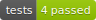

# AIDIF Matlab Toolbox

[](https://github.com/aidif/aidif-toolbox/releases/latest)
[](https://github.com/aidif/aidif-toolbox/actions/workflows/test-code.yml)
[](https://github.com/aidif/aidif-toolbox/security/code-scanning)
[](https://github.com/aidif/aidif-toolbox/actions/workflows/run-codespell.yml)
[](https://gitHub.com/aidif/aidif-toolbox/graphs/commit-activity)

A comprehensive set of validated models and tools to perform pre-clinical evaluation for AID systems and their components.

## Description

The AID Interoperability Framework (AIDIF) is intended to be a public, modular computational modeling and simulation environment for development and evaluation of AID systems and components. Building on over a decade of proprietary simulator development experience, AIDIF aims to integrate validated models of CGMs, insulin pumps, and control algorithms with physiological and behavioral models derived from public high quality and representative clinical data.

## Requirements and installation
It is recommended to use **MATLAB R2019b** or later.
The following MathWorks products are required:
- MATLAB
- Matlab Simulink
- 

Users or developers who clone the repository using git can use [MatBox](https://github.com/ehennestad/MatBox) to quickly install this project's [requirements](./requirements.txt) (if any):

```matlab
AIDIFtools.installMatBox() % If MatBox is not installed
matbox.installRequirements(path/to/toolboxRootDir)
```

## Getting started

```matlab
< add some code examples here >
```

### Setup

Background:

- [miss hit: tools for improving code quality and correctness](https://florianschanda.github.io/miss_hit/)
- [pre-commit: framework for pre-commit hooks](https://pre-commit.com/)

Process:

- Install the prerequests for the [python virtial environment](https://docs.python.org/3/library/venv.html)
- Ensure you are in the directory this repository resides in 
- Initialize and activate the environment
```
> make init
> source .venv/bin/activate
```
- Install the required components
```
> make install
```
- Ensure your setup is valid
```
> make validate-setup
```

### Code validation checks

- When you are at a point you want to check your code 

```
> make run
```
- This will run the static code analysis and any automated tests to ensure the current state of your code
- When you are ready to commit your changes the static code analysis checks will run automatically 

NOTE: If you want to skip the checks on check-in then add `--no-verifying` to your commit message. These checks will still run as part of the CI process though


## Contributing
Please see the [Contributing guidelines](.github/CONTRIBUTING.md) and the [Developer notes](.github/DeveloperNotes.md)

## License

This project is available under the MIT License. See the LICENSE file for details.

## Author

Lane Desborough (lane@aidif.org)
aidif.org
